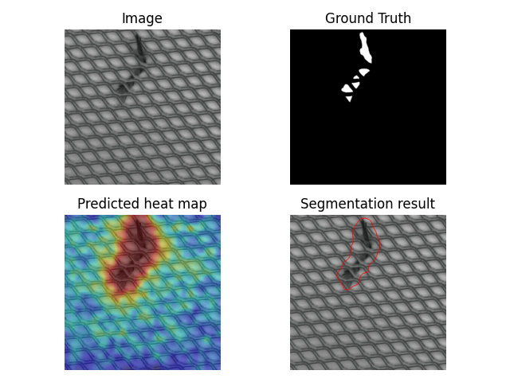
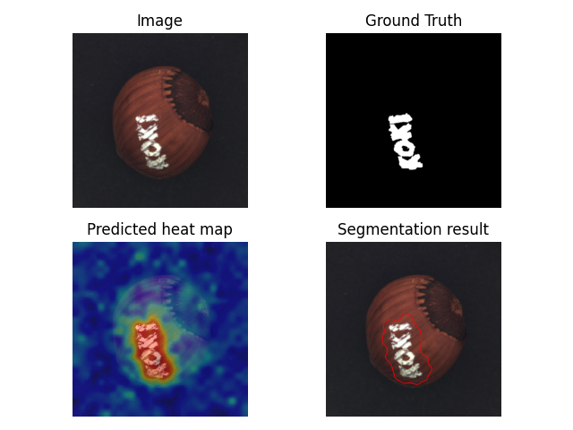
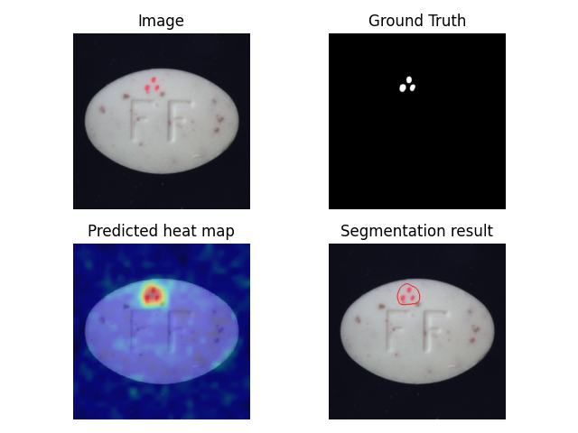
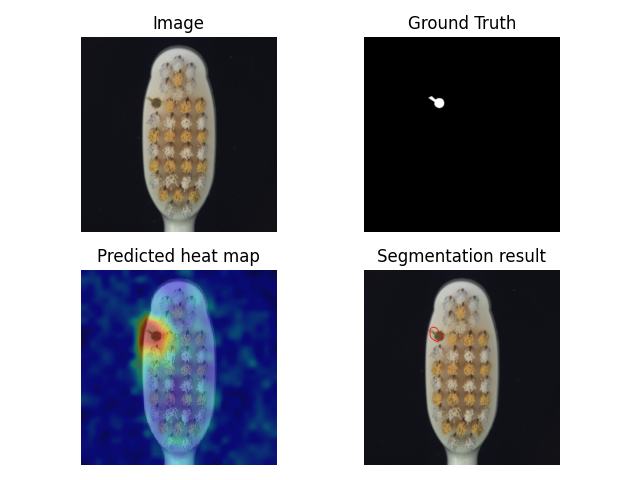
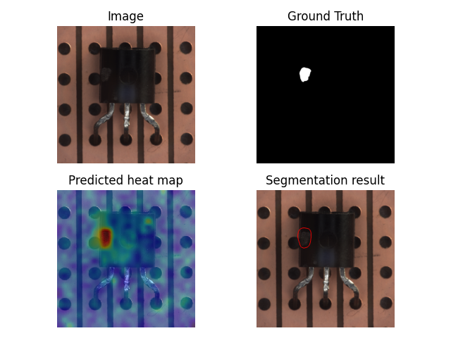

# FastFlow-main

An unofficial PyTorch implementation of [_FastFlow: Unsupervised Anomaly Detection and Localization via 
2D Normalizing Flows_](https://arxiv.org/abs/2111.07677) (Jiawei Yi et al.)

This code is based on [gathierry's FastFlow](https://github.com/gathierry/FastFlow). 
I make some changes (e.g. save segmentation result images on evaluate phase).
Thanks gathierry.

## Installation
Install packages with:

    pip install -r requirements.txt

## Dataset
Download [MVTec-AD](https://www.mvtec.com/company/research/datasets/mvtec-ad) dataset.

The MVTec-AD dataset is organized as follows:

    dataset-path/bottle/train/good/                  # train (normal)
    dataset-path/bottle/test/good/                   # test  (normal)
    dataset-path/bottle/test/defect-type/            # test  (abnormal)
    dataset-path/bottle/ground_truth/defect-type/    # GT    (abnormal)

## Train
Use CaiT as example

    python main.py -cfg configs/cait.yaml --data_path path/to/dataset -cat category

## Evaluate
You can also show the result images in _visualizations_ folder.

    python main.py -cfg configs/cait.yaml --eval --data_path path/to/dataset -cat category -ckpt _fastflow_experiment_checkpoints/exp[index]/[epoch#]

## Performance
### Image-level AUROC

| category |  bottle  | cable | capsule | carpet | grid  | hazelnut | leather | metal_nut | pill  | screw | tile  | toothbrush | transistor | wood  | zipper |
|----------|:--------:|:-----:|:-------:|:------:|:-----:|:--------:|:-------:|:---------:|:-----:|:-----:|:-----:|:----------:|:----------:|:-----:|:------:|
| ours     |  1.000   | 0.999 |  0.994  | 1.000  | 0.994 |  0.999   |  1.000  |   1.000   | 0.984 | 0.951 | 1.000 |   0.958    |   1.000    | 1.000 |        |
| paper    |  1.000   | 1.000 |  1.000  | 1.000  | 0.997 |  1.000   |  1.000  |   1.000   | 0.994 | 0.978 | 1.000 |   0.944    |   0.998    | 1.000 | 0.995  |

### Pixel-level AUROC

| category | bottle | cable  | capsule | carpet | grid  | hazelnut | leather | metal_nut | pill  | screw | tile  | toothbrush | transistor | wood  | zipper |
|----------|:------:|:------:|:-------:|:------:|:-----:|:--------:|:-------:|:---------:|:-----:|:-----:|:-----:|:----------:|:----------:|:-----:|:------:|
| ours     | 0.977  | 0.982  |  0.990  | 0.994  | 0.976 |  0.993   |  0.996  |   0.982   | 0.989 | 0.994 | 0.970 |   0.992    |   0.974    | 0.960 |        |
| paper    | 0.977  | 0.982  |  0.991  | 0.994  | 0.983 |  0.991   |  0.995  |   0.985   | 0.982 | 0.994 | 0.963 |   0.989    |   0.973    | 0.970 | 0.987  |

## Sample Results

