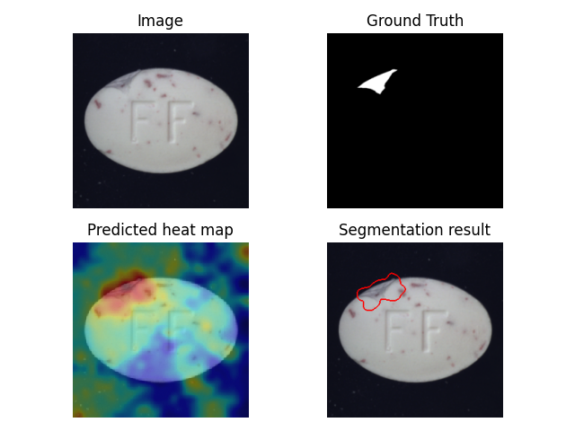
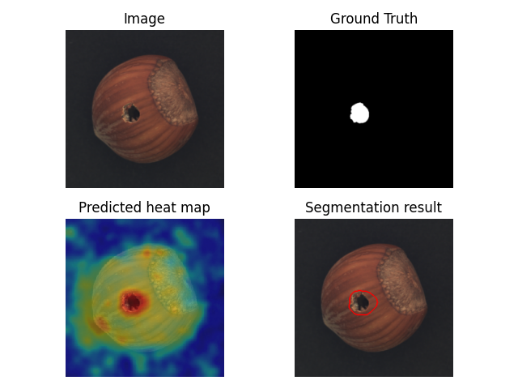

# FastFlow-main

An unofficial PyTorch implementation of [_FastFlow: Unsupervised Anomaly Detection and Localization via 
2D Normalizing Flows_](https://arxiv.org/abs/2111.07677) (Jiawei Yi et al.)

This code is based on [gathierry's FastFlow](https://github.com/gathierry/FastFlow). 
I make some changes (e.g. save segmentation result images on evaluate phase).
Thank you to gathierry :).

## Installation
Install packages with:

    pip install -r requirements.txt

## Dataset
Download [MVTec-AD](https://www.mvtec.com/company/research/datasets/mvtec-ad) dataset.

The MVTec-AD dataset is organized as follows:

    dataset-path/bottle/train/good/                  # train (normal)
    dataset-path/bottle/test/good/                   # test  (normal)
    dataset-path/bottle/test/defect-type/            # test  (abnormal)
    dataset-path/bottle/ground_truth/defect-type/    # GT    (abnormal)

## Train
Use ResNet-18 as example

    python main.py -cfg configs/resnet18.yaml --data_path path/to/dataset -cat category --batch_size 32 --lr 1e-3 --wd 1e-5 --epochs 500

## Evaluate

    python main.py -cfg configs/resnet18.yaml --data_path path/to/dataset -cat category -ckpt _fastflow_experiment_checkpoints/exp[index]/[epoch#] --eval

## Sample Results

